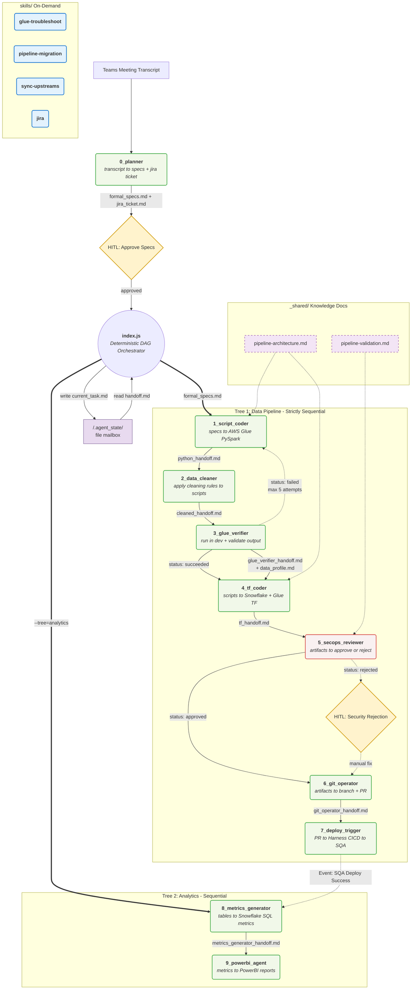

# SEC-SWARM — Architecture Overview

> **A deterministic, self-correcting multi-agent pipeline that takes a security data-engineering request from a raw meeting transcript all the way to a deployed AWS Glue + Snowflake stack — with a human in the loop only where it matters.**

> [!NOTE]
> This repository contains the **architectural blueprint, design trade-offs, and system diagrams** for an internal multi-agent AI pipeline I engineered. **Proprietary business logic, internal instructions, and source code have been omitted.** What remains is the engineering reasoning: how the system is structured, why it is structured that way, and what I would tell a reviewer about building agentic systems that survive contact with a real production environment.

---

## Table of Contents

1. [The Problem](#1-the-problem)
2. [System Architecture](#2-system-architecture)
3. [Key Engineering Decisions](#3-key-engineering-decisions)
4. [Tooling &amp; Security](#4-tooling--security)
5. [The Agents](#5-the-agents)
6. [Observability by Design](#6-observability-by-design)
7. [Success Metrics](#7-success-metrics)
8. [Repository Layout](#8-repository-layout)
9. [Further Reading](#9-further-reading)

---

## 1. The Problem

Standing up a new security data pipeline used to be a slow, multi-day, multi-person relay:

- A meeting produces a vague set of requirements ("we need to ingest the new vendor's audit logs into Snowflake").
- An engineer translates that into a Jira ticket, then into AWS Glue PySpark ETL, then into Terraform for Glue + Snowflake, then into a PR, then into a Harness CI/CD deploy.
- Somewhere in that chain, a hardcoded secret or an over-privileged IAM role slips through. Or the Glue job fails in dev and nobody notices until the deploy.
- Every handoff between humans is a place where context is lost and time is burned.

**SEC-SWARM compresses that relay into a single deterministic run.** It starts from the meeting transcript and ends at a deployed, security-reviewed SQA stack, pausing for a human exactly twice: once to approve the spec, once to sign off on the security review.

### Success Metrics (targets)

| Metric | Target |
| --- | --- |
| End-to-end time (transcript → SQA deploy) | **< 45 minutes** |
| Human intervention points | **Exactly 2** (spec approval + security gate) |
| Security gate catch rate | **100%** of hardcoded secrets, **>90%** of IAM over-privilege |
| Reproducibility | Same input → same DAG path (deterministic orchestration) |
| Debuggability on failure | `.agent_state/` **always** contains partial artifacts |

---

## 2. System Architecture

SEC-SWARM is **not** built on LangChain, AutoGen, or any framework where an LLM decides what runs next. It is a **Deterministic Directed Acyclic Graph (DAG)** implemented as a small, zero-dependency Node.js orchestrator (`index.js`). The orchestrator — not the model — owns control flow.



> The raw Mermaid source lives in [`architecture.mmd`](./architecture.mmd). A deep walkthrough of the DAG and the mailbox is in [`docs/system-design.md`](./docs/system-design.md).

The workflow is split into **two sequential trees**:

- **Tree 1 — Pipeline (steps 0–7):** meeting transcript → deployed data-engineering stack.
- **Tree 2 — Analytics (steps 8–9):** deployed tables → Snowflake SQL metrics → PowerBI reports. Runs immediately after Tree 1 (triggered by an SQA-deploy-success event) or standalone via `--tree=analytics`.

### Why a Deterministic DAG and not LangChain / AutoGen?

| | Agent-decides-next-step framework | SEC-SWARM Deterministic DAG |
| --- | --- | --- |
| **Control flow** | An LLM "reasons" about which tool/agent runs next | Hardcoded in `index.js`; the model never chooses the path |
| **Reproducibility** | Same input can take different paths (temperature, drift) | Same input → same path, every run |
| **Debuggability** | Opaque; you re-run and hope | Every step's input and output is a file on disk |
| **Blast radius of a bad LLM decision** | Can wander into the wrong tool/directory | Bounded: the orchestrator only ever hands an agent one task |

In a real production environment you cannot let a hallucination decide whether to run `terraform apply` or trigger a deploy. **The LLM is a worker inside each node; the graph is the source of truth.**

---

## 3. Key Engineering Decisions

### Decision 1 — The File-Based Mailbox (`.agent_state/`)

State is **not** passed in memory between agents. The orchestrator writes a `current_task.md` "baton" into `.agent_state/`, spawns the agent scoped to that directory, and the agent writes back a `<name>_handoff.md`. The orchestrator reads the handoff, validates it, and composes the next baton.

Why pay the cost of disk I/O between every step?

- **Observability** — every input and output is a plain Markdown file you can `cat`, diff, and grep. There is no hidden in-process state.
- **Debuggability** — when step 3 fails, the exact prompt it received and the exact handoff it produced are still sitting on disk.
- **Resumability** — because state is durable, a later run can pick up from any completed step (see Decision 3).
- **Decoupling** — each agent is a separate sandboxed process. It only knows about files, not about the orchestrator's internals.

Full detail: [`docs/system-design.md`](./docs/system-design.md).

### Decision 2 — The Self-Correcting Execution Loop (Verify → Fix → Re-verify)

Steps 1–3 form a closed feedback loop with a **bounded maximum of 5 attempts**:

```
1_script_coder  ──►  2_data_cleaner  ──►  3_glue_verifier
      ▲                                          │
      └──────────  status: failed  ◄─────────────┘
              (CloudWatch logs + error status fed back in)
```

`3_glue_verifier` authenticates to the AWS **dev** account, uploads the generated script to S3, starts the real Glue job, and polls to completion:

- **On success** — it downloads sample output, profiles the columns/types into `glue_verifier_data_profile.md`, and the DAG advances to Terraform.
- **On failure** — it pulls the Glue run status **and CloudWatch logs**, writes them into its handoff, and the orchestrator feeds that error report *back to the script coder* with a "here is what broke, fix it" task. The cleaner re-runs, and the verifier tries again.

This is the point of the whole project: **the system does not just write code, it runs the code, reads the real error, and fixes itself** — up to 5 times before it gives up and halts with the full failure report preserved on disk. Full detail: [`docs/error-handling.md`](./docs/error-handling.md).

### Decision 3 — State Resumability (`--from N`)

Long agentic chains are expensive. If step 5 fails, re-running steps 0–4 wastes ~40 minutes of LLM + AWS time. The `--from N` flag tells the orchestrator to **skip** the first N steps and load their handoff files from `.agent_state/` instead of regenerating them:

```bash
# Something broke at the security review; fix it and resume from step 5
node index.js --from 5
```

The orchestrator validates that every required prior handoff exists on disk before it resumes; if a handoff is missing it fails loudly rather than silently continuing with incomplete context. Because the mailbox is durable, resuming is deterministic — you continue with exactly the artifacts the earlier run produced.

### Decision 4 — Human-in-the-Loop at exactly two gates

Full autonomy is a liability at the two moments where a mistake is expensive and irreversible. The orchestrator uses Node's `readline` to hard-pause and wait for a human:

- **After Planning** — approve the formal spec before any code is generated. (Cheap to fix a misunderstanding here; very expensive to fix it after deploy.)
- **After Security Review** — if the SecOps reviewer returns `status: rejected`, the pipeline stops and requires a human to fix the issue and explicitly continue.

Everything else runs unattended. The design goal is **maximum autonomy with minimum blast radius**, not autonomy for its own sake.

---

## 4. Tooling &amp; Security

Each agent is a sandboxed CLI process, not a trusted insider:

- **Filesystem sandboxing** — agents only see directories explicitly granted via `--add-dir`. The planner sees only `.agent_state/`; the Terraform coder additionally sees the upstream `aws-secdatalake/snowflake` and `aws-secdatalake/glue` references; the script coder sees `aws-secdatalake/src`. An agent cannot read or write outside its grant.
- **Built-in MCP disabled** — the orchestrator launches agents with `--disable-builtin-mcps`. Rather than exposing a broad, auto-discovered tool surface (Model Context Protocol servers), each agent gets a **small, explicit set of vetted shell scripts** (`aws_auth.sh`, `scan_secrets.sh`, `create_pr.sh`, …). Least privilege for tools, not just for files.
- **A dedicated security node** — `5_secops_reviewer` scans every artifact for hardcoded secrets (Snyk), IAM over-privilege, SQL injection, and data-exfiltration risk *before* anything reaches a PR, and its rejection is a hard HITL stop.

Full detail: [`docs/tooling-and-security.md`](./docs/tooling-and-security.md).

---

## 5. The Agents

| Step | Agent | Core Tool(s) | Responsibility |
| --- | --- | --- | --- |
| 0 | `planner` | `jira-api.js` | Meeting transcript → formal spec + Jira ticket |
| 1 | `script_coder` | `test_python.sh` | Spec → AWS Glue PySpark ETL (lint + syntax check) |
| 2 | `data_cleaner` | `test_python.sh` | Apply standardized cleaning rules to scripts |
| 3 | `glue_verifier` | `aws_auth.sh`, `glue_run.sh` | Run job in AWS dev, validate output, pull logs on failure |
| 4 | `tf_coder` | `validate_tf.sh` | Scripts → Snowflake + Glue Terraform (`fmt` + `validate`) |
| 5 | `secops_reviewer` | `scan_secrets.sh` | Approve / reject artifacts (secrets, IAM, injection) |
| 6 | `git_operator` | `create_pr.sh` | Branch, commit, open PR |
| 7 | `deploy_trigger` | `harness_api.sh` | Trigger Harness CI/CD, poll SQA deploy |
| 8 | `metrics_generator` | `run_sql.sh` | Deployed tables → Snowflake SQL metrics |
| 9 | `powerbi_agent` | `deploy_report.sh` | Metrics → PowerBI reports |

**Shared knowledge** (`_shared/`, read-only, scoped via `--add-dir`): `pipeline-architecture.md` (raw-only vs raw+modeled decision) feeds the script and TF coders; `pipeline-validation.md` (ETL output checklist) feeds the verifier and SecOps reviewer.

**On-demand skills** (outside the DAG): `glue-troubleshoot`, `pipeline-migration`, `sync-upstreams`, `jira`.

---

## 6. Observability by Design

Because state lives on disk, a completed or failed run is fully inspectable. The [`mock_data/`](./mock_data/) directory contains representative (sanitized) artifacts so you can see exactly what the mailbox looks like mid-run:

- [`mock_data/0_planner_handoff_mock.md`](./mock_data/0_planner_handoff_mock.md) — what a successful planning handoff looks like.
- [`mock_data/3_glue_verifier_error_mock.md`](./mock_data/3_glue_verifier_error_mock.md) — a **failed** Glue verification, including the CloudWatch error that gets fed back to the coder.

This is what "debugging model behavior" means in practice: you are never staring at an opaque trace — you are reading the exact files the agents read and wrote.

---

## 7. Success Metrics

See the [targets table](#success-metrics-targets) above. The two that matter most to me as an engineer:

- **Deterministic reproducibility** — same input, same DAG path. This is what makes the system *debuggable* at all.
- **Failure always leaves actionable artifacts** — a crash is never a dead end; `.agent_state/` holds the partial work and the exact error.

---

## 8. Repository Layout

```text
sec-swarm-architecture-overview/
├── README.md                          # This file — the showcase
├── architecture.mmd                   # Mermaid source for the DAG
├── docs/
│   ├── system-design.md               # DAG execution model + file mailbox
│   ├── error-handling.md              # Verify → Fix → Re-verify retry loop
│   ├── prompt-engineering-patterns.md # Reusable instruction patterns (no proprietary prompts)
│   └── tooling-and-security.md        # Sandboxing, --add-dir, --disable-builtin-mcps
└── mock_data/                         # Sanitized runtime artifacts (proves observability)
    ├── 0_planner_handoff_mock.md
    └── 3_glue_verifier_error_mock.md
```

---

## 9. Further Reading

- **[System Design](./docs/system-design.md)** — the DAG execution model, the baton/handoff protocol, and why disk beats memory.
- **[Error Handling](./docs/error-handling.md)** — the bounded self-correction loop in detail.
- **[Prompt Engineering Patterns](./docs/prompt-engineering-patterns.md)** — the reusable *patterns* behind the agent instructions.
- **[Tooling &amp; Security](./docs/tooling-and-security.md)** — how the agents are sandboxed and how the tool surface is minimized.
